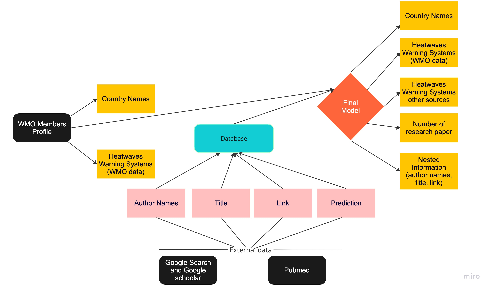

## Data Engineering & Modeling Journey

### WMO Data Extraction & Retrieval

1. **WMO Data Extraction**:
   - Extracted data from the embedded Power BI dashboard on the [WMO website](https://community.wmo.int/en/members/profiles), navigating the complexities of dynamic content.
   - Implemented a strategy to handle request limits by segmenting data extraction, ensuring comprehensive data retrieval.

2. **PubMed Data Retrieval**:
   - Utilized the PubMed API to fetch data using country names and specific keywords.
   - Transformed the XML API response into a structured DataFrame for analysis.

### Data Cleaning, Validation & Integration

1. **Data Harmonization**:
   - Merged and compared the extracted data with the WMO template to ensure consistency.
   
2. **Collaborative Data Validation**:
   - Worked with team members Fatimah and Slywia to:
     - Identify specific data discrepancies.
     - Validate the data's accuracy, streamlining the cleaning process.

3. **Data Integration**:
   - Combined PubMed search results with Felista's data from Google Search and Google Scholar to create a unified dataset.

### Predictive Modeling & Analysis

1. **Tokenization**:
   - Employed Hugging Face's RobertaTokenizer for efficient tokenization of text data.

2. **Model Utilization**:
   - Used a pretrained RoBERTa model to predict the presence of heatwave systems based on research paper abstracts.
   - Recognized the potential for model enhancement through additional training and fine-tuning in future iterations.

### Google Scholar and Google Search Data Engineering

1. **Data Collection with Python and BeautifulSoup**:
   - Utilized Python and BeautifulSoup to scrape data from Google Scholar and perform Google searches for heatwave warning systems.
   - Extracted relevant information from web pages, including keywords and countries mentioned.
   - Employed Python to filter out web pages where country data couldn't be obtained.

2. **Data Preprocessing**:
   - Matched web-scraped data with WMO's dataset to categorize entries as known or unknown.
   - Created binary labels (0 for not present, 1 for present) based on keyword presence.
   - Addressed class imbalance issues using Python libraries such as SMOTE.

3. **Model Selection & Training**:
   - Utilized Python libraries like Scikit-Learn to explore various classification machine learning models.
   - Determined model selection based on accuracy scores and selected Random Forest Classifier as the final model.
   - Trained the Random Forest Classifier using known data and performed cross-validation and hyperparameter tuning.

4. **Model Evaluation**:
   - Applied the trained model to predict heatwave warning system status for unknown entries and evaluated model performance.
   - Achieved an accuracy of 0.7042 with the Random Forest Classifier.

5. **Challenges**:
   - Addressed class imbalance challenges using Python's SMOTE technique.
   - Overcame web scraping complexities with BeautifulSoup to obtain relevant data and handled noisy data using Python.

### Database Creation 

1. **Data Deduplication**:
   - Checked the combined dataset from Google Scholar, Google Search, and PubMed for duplicates.
   - Ensured data integrity by removing any redundant entries.
2. **Country Names**:
    - Country names adjusted made sure that both match

### Final Model
1. **Final Model Structuring**:
    - WMO field has been filled by the data extracted from the WMO website
   - For each country, aggregated the number of research papers and stored detailed information (like authors, titles, abstracts) in a nested field.
   - We added number of publications found 
   - Heatwaves Warning Systems other sources filled with final prediction result

2. **Final Prediction Logic**:
   - Adopted a rule-based approach for the final prediction:
     - If even a single prediction indicated that a country has a heatwave warning system, the country was marked as having a system.
     - This decision was based on the rationale that even a single indication is worth investigating further.
     - This ideal for small databases 

3. **Rationale & Future Adjustments**:
   - The current approach is designed to emphasize thorough investigation.
   - While this phase prioritized identifying potential heatwave systems worth investigating, the approach can be adjusted in the future. For instance, a majority-rule approach can be adopted, where a country is marked as having a system only if the majority of predictions indicate so.
   - Feedback and further model refinements can guide these adjustments.
   - This approach can be more suitable for the bigger databases 
   Given that you've discovered a discrepancy in the data (Australia having a heatwave warning system but not being reported as such in the WMO data), it's essential to document this finding. This discrepancy can be highlighted under a new section called "Data Discrepancies & Case Studies". Here's how you can structure it:

### Data Discrepancies & Case Studies

1. **Australia's Heatwave Warning System**:
   - **Discovery**: Our machine learning model and WMO data did not indicate the presence of a heatwave warning system for Australia.
   - **Validation**: Upon further investigation, consulting Australia's official meteorological and disaster preparedness websites revealed that Australia indeed has an operational heatwave warning system in place. [Link to the website for reference]
   - **Implications**: This discrepancy underscores the importance of continuous validation and the iterative nature of data projects. It also highlights potential gaps in the WMO's reporting or our data extraction methods.
   - **Future Considerations**: Such discrepancies can be used to refine our model further. The number of publications or the presence of official meteorological websites could potentially be integrated into the model as additional features or validation steps.

